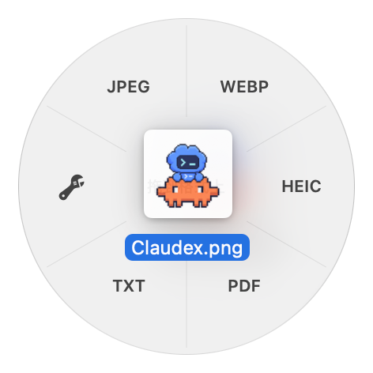
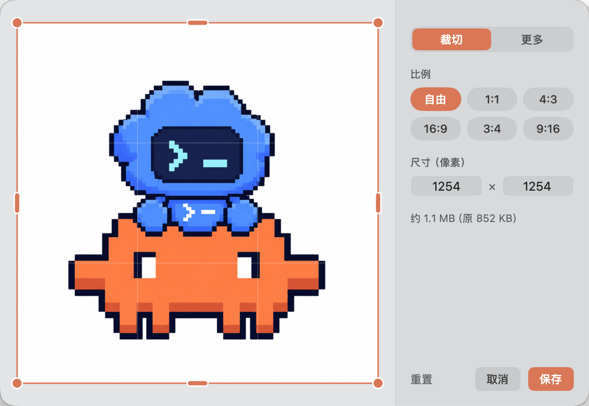

<p align="center"></p>

# Phaeton · 轻與

[English](README.en.md)

轻量的 macOS 文件转换工具：**按住 Shift 拖动文件，光标处出现轮盘，拖到目标格式上松手**。结果存在原文件旁，原文件不动。灵感来自《GTA V》的武器轮盘和《Apex Legends》的标点系统。

<p align="center">
  
  &nbsp;&nbsp;
  
</p>

- **只在菜单栏：** 没有 Dock 图标。菜单栏里的小车轮打开一个面板：运行状态、开机自启、怎么用、要授权什么。面板关着时它照样在后台等你拖文件。
- **原生：** 主要用 macOS 自带框架，没有后台服务，不上传文件。
- **触发不需要权限：** 只监听鼠标事件和拖拽剪贴板。
- **不止转换：** 拖到轮盘左边的**扳手**上，打开带预览的编辑窗口（图片裁切 / 去背景 / 压缩，视频和音频剪切，PDF 拆分）。

## 安装（三步，约一分钟）

需要 Apple 芯片的 Mac（M1 及以后），macOS 13 或更新。

**第 1 步：打开“终端”。** 按 `⌘ + 空格` 打开聚焦搜索，输入 `终端`（英文系统输入 `Terminal`），回车。

**第 2 步：复制下面这一行，粘贴到终端里，按回车。** 点代码框右上角的复制按钮即可。

```bash
curl -fsSL https://raw.githubusercontent.com/Smartin524/Phaeton/main/scripts/install.sh | bash
```

**第 3 步：等它跑完。** 看到菜单栏出现小车轮、弹出 Phaeton 面板就装好了，终端可以关掉。以后按住 **Shift** 拖文件即可。

之后：
- **升级**：再运行一遍上面那一行。
- **卸载**：在终端运行 `rm -rf /Applications/Phaeton.app ~/Library/Application\ Support/Phaeton`。
- **想先看看它做了什么**：这一行只是下载并运行[这个脚本](scripts/install.sh)——从 [Releases](https://github.com/Smartin524/Phaeton/releases) 取最新版、校验 SHA-256、装进“应用程序”并打开。

<details>
<summary>不想用终端？手动下载</summary>

1. 到 [Releases](https://github.com/Smartin524/Phaeton/releases) 下载 `Phaeton.zip`，双击解压，把 `Phaeton.app` 拖进“应用程序”。
2. 双击打开，系统会提示无法打开。别点“移到废纸篓”，点“完成”。
3. 打开“系统设置 → 隐私与安全性”，往下找到 Phaeton，点“仍要打开”，输入开机密码。

（没有开发者签名和公证，所以手动下载的版本第一次会被系统拦下；用终端命令安装不会遇到。）
</details>

## 能转什么

| 拖的文件 | 轮盘上的格式 |
|---|---|
| 图片（含 SVG） | PNG / JPEG / WebP\* / HEIC / PDF / TXT（识别文字） |
| 视频 | M4A / WAV / AIFF（提取音频）、MP3\*、MP4 / MOV |
| 音频 | M4A / WAV / AIFF / MP3\* |
| PDF | PNG / JPEG、TXT / MD（无文字层时 OCR）、DOCX\* |
| TXT / MD / RTF / DOC / DOCX / ODT | TXT / MD / RTF / DOCX / PDF |

\* 需要[可选组件](#可选组件)。一次拖多个文件时多一格：**合并 PDF**（图片或 PDF）、**拼接**（视频或音频）。

**转 MD**（方便贴给 AI）：保留标题、粗体 / 斜体、链接、多级列表和表格。DOCX 直接读 Word 文件结构；PDF 按字号推断标题，把断行合并成段落，去掉页眉页脚和页码。反过来，MD 转 PDF / DOCX / RTF 时会按 Markdown 排版，而不是原样印出 `#` 和 `**`。

**扳手窗口**

- **图片：** 裁切（比例或直接填像素）、画质、去背景、压缩到指定大小、去元数据、复制图中文字、识别二维码。
- **视频：** 快速剪切（无损）、取当前帧、压缩（清晰度或指定大小）、静音、变速。
- **音频：** 波形上选片段，可淡入淡出。
- **PDF：** 预览、提取指定页、每页拆成单独 PDF。

## 其他

- **Finder 右键：** 快速操作 / 服务 → “用轻與转换…”（没看到就到“系统设置 → 键盘 → 键盘快捷键 → 服务”勾选）。
- **进度：** 松手后轮盘变成进度圆环，点击圆环取消；结束发系统通知。
- **已选中的文件按 Shift 会被 Finder 取消选中：** 先拖起文件再按 Shift，或在菜单栏面板的“授权”里打开“已选中文件时，按 Shift 不取消选中”（需要辅助功能权限，默认关闭）。
- **不覆盖已有文件：** 先写临时文件再改名，重名自动加数字，失败不留残渣。

## 可选组件

WebP、MP3、PDF→DOCX 需要一次性安装（约 250 MB，联网），装进 `~/Library/Application Support/Phaeton`，不改动系统。第一次用到时会询问；也可运行 `bash scripts/install-extras.sh`。它们有各自的许可证（GPL / AGPL / LGPL），见 [THIRD-PARTY.md](THIRD-PARTY.md)。

## 构建与测试

macOS 13+ 和 Swift 工具链，无 Swift 包依赖。

```bash
bash scripts/make-signing-identity.sh  # 只需一次：在登录钥匙串里生成本机签名证书
bash scripts/build-app.sh     # 生成 dist/Phaeton.app
swift test                    # 单元测试，需要完整 Xcode
bash scripts/validate.sh      # 引擎端到端检查，样本现场生成
bash scripts/make-release.sh  # 打包 Release zip
```

测试覆盖转换引擎，不含界面和拖拽手感。

签名：有“Phaeton Local Signing”证书时用它签名，辅助功能授权在重新构建、更新后依然有效，且只有持有这把私钥的机器能签出匹配的程序；没有时退回普通的临时签名，每次构建后需要重新授权。

## 已知限制

- 拖拽监听依赖 macOS 向后台应用传递鼠标事件；收不到时轮盘不出现，可用右键入口。
- 不支持 MKV / WebM / AVI 输入、FLAC / OGG 输出、Word 以外的 Office 转 PDF。
- PDF→DOCX 不保证复杂排版，扫描件不做文字识别。
- PDF→MD 是推断出来的结构：PDF 里的表格会变成逐行文字，图文混排的页面段落可能被切碎。

MIT 许可，见 [LICENSE](LICENSE)。
